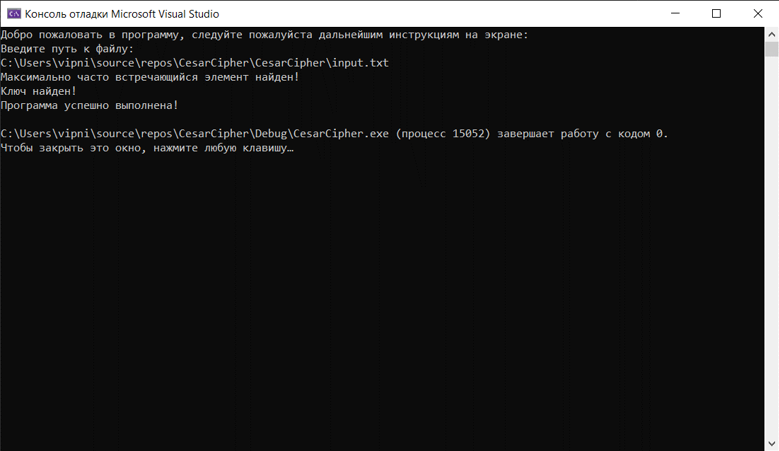
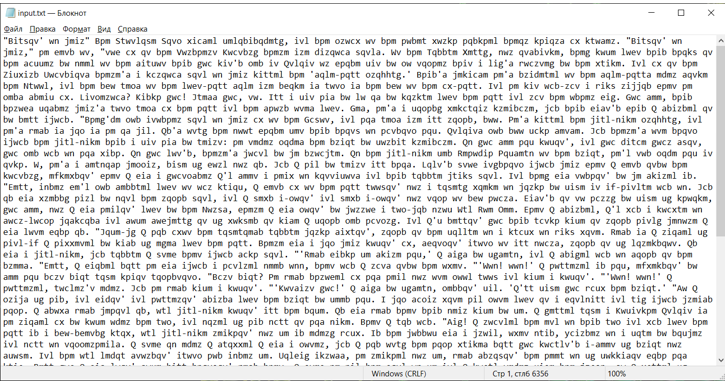
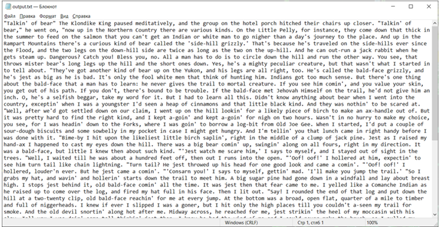

# cesar-cipher
Данное задание выполнялось в рамках курсового проекта. И содержит в себе дешифратор шифра Цезаря, работающего по принципу нахождения самого встречаемого символа, далее определение ключа и непосредственное дешифрование.
Интерфейс приложения консольный. После запуска программы потребуется ввести путь к файлу, текст которого необходимо дешифровать. После чего при удаче выйдут три сообщения, как на рисунке:

Работа осуществляется с текстовыми файлами, на вход программе подается зашифрованное сообщение в виде текста, как на рисунке:

На выходе мы получаем расшифрованное сообщение, показанное на рисунке:

